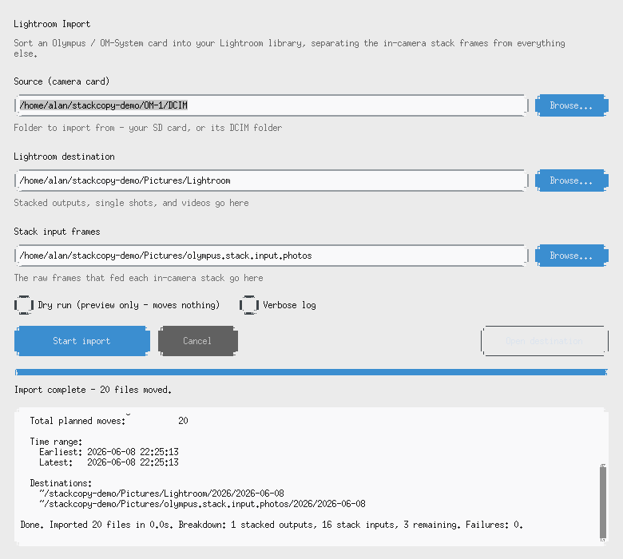

# stackcopy

Olympus / OM-System in-camera stacking produces many RAW/JPG frames per final JPG. Lightroom doesn't automatically group or separate them, so imports get cluttered. This script separates originals from stacked outputs automatically, so you only need to manually process the photos that actually need your attention.

Works on Linux, macOS, WSL, and Windows.

Prefer a window to the command line? There's a point-and-click [graphical interface](#graphical-interface-gui) for the import workflow.

## How it works

The script finds stacked images by looking for JPG files that have no corresponding RAW file. This is the only reliable way I've found to detect which images are the stacked versions — the file sizes and EXIF data are not unique for photos created with in-camera stacking.

The matching is case-insensitive, so `IMG_1234.JPG` will match with `img_1234.orf` just fine.

Supported RAW extensions: `.orf`, `.cr2`, `.nef`, `.arw`, `.dng`, `.pef`, `.rw2`, `.raf`, `.raw`, `.sr2`.

Supported video extensions for `--lightroomimport`: `.mov`, `.mp4`, `.m4v`, `.avi`, `.mts`, `.m2ts`, `.mpg`, `.mpeg`, `.wmv`.

## Installation

Clone the repo:

```bash
git clone https://github.com/AlanRockefeller/stackcopy.git
cd stackcopy
```

Or download just the script:

```bash
wget https://raw.githubusercontent.com/AlanRockefeller/stackcopy/main/stackcopy.py
chmod +x stackcopy.py
```

On Windows, download `stackcopy.py` and run it with `py`:

```powershell
py .\stackcopy.py --help
```

**Requirements**: Python 3.10 or newer. No extra packages needed.

## Graphical interface (GUI)

If you'd rather not use the command line, there's a simple GUI for the
`--lightroomimport` workflow. It asks for the source and the two destination
folders, then shows a live log and progress bar while it works. It doesn't
reimplement anything — under the hood it just runs `stackcopy.py` for you, so
the part that actually moves your photos is the same tested code.



### Using it

1. **Launch it** — open the downloaded app, or run `python stackcopy_gui.py`.
2. **Pick the source** — the folder to import from (your SD card, or its `DCIM`
   folder). It's scanned recursively, exactly like `--lightroomimport`.
3. **Check the destinations** — the **Lightroom destination** (where stacked
   outputs, single shots, and videos go) and the **Stack input frames** folder
   (where the raw frames that fed each stack go) come pre-filled with the same
   defaults the command line uses. Click **Browse...** to change either one.
4. **Optionally tick _Dry run_** to preview every move without touching a file —
   the button changes to **Preview (dry run)**. Tick **Verbose log** for
   per-file detail.
5. **Click _Start import_.** A progress bar and live log show each file as it
   moves, with a running `done / total` count. You can **Cancel** at any time —
   files move one at a time and the import is re-runnable, so stopping is safe.
   If the destination is low on space, it asks before continuing.
6. When it finishes, **Open destination** opens your Lightroom folder.

Files land in exactly the same place as the `--lightroomimport` command — see
[Where files go](#where-files-go).

### Easiest: download the app

Grab the prebuilt app from the [Releases page](https://github.com/AlanRockefeller/stackcopy/releases):

- **macOS** — `Stackcopy.dmg`: open it, drag **Stackcopy** to Applications, launch it.
- **Windows** — `Stackcopy.zip`: unzip it, then double-click `Stackcopy.exe`.
  Keep `StackcopyCLI.exe` in the same folder; the GUI uses it for imports.

> **First launch of an unsigned app:** macOS may say it's from an unidentified
> developer — right-click the app and choose **Open**, then **Open** again.
> Windows SmartScreen may warn — click **More info → Run anyway**. These
> warnings disappear once the app is code-signed.

### Run from source

Works anywhere Python does (Linux, macOS, Windows):

```bash
pip install -r requirements-gui.txt
python stackcopy_gui.py
```

The only extra dependency is `customtkinter`. If you get a `tkinter` import
error, install Tk for your platform (`brew install python-tk` on macOS, or your
distro's `python3-tk` package on Linux; it's already included on Windows).

### Build the app yourself

The workflow in `.github/workflows/build-gui.yml` builds both the macOS `.dmg`
and the Windows bundle automatically when you push a version tag
(`git tag v1.0.0 && git push --tags`) and attaches them to the release. To
build locally on the matching OS:

```bash
pip install -r requirements-gui.txt -r requirements-build.txt
pyinstaller packaging/stackcopy_gui.spec
# -> dist/Stackcopy.app (macOS)
# -> dist/Stackcopy/Stackcopy.exe + StackcopyCLI.exe (Windows)
# -> dist/Stackcopy (Linux)
```

PyInstaller can't cross-compile, so build the macOS app on a Mac and the
Windows app on Windows — or just let the workflow do both.

## The five modes

### `--copy SRC_DIR DEST_DIR`

Finds JPGs without matching RAW files and copies them to a destination folder.

```bash
./stackcopy.py --copy /photos/Lightroom/2025/2025-07-10/ /photos/stacked-images
```

### `--rename [DIR]`

Finds those JPGs and renames them in-place by adding " stacked" to the filename.

```bash
./stackcopy.py --rename /photos/Lightroom/2025/2025-07-10/
```

### `--stackcopy [DIR]`

Copies them to a "stacked" subfolder and adds " stacked" to their names.

```bash
./stackcopy.py --stackcopy /photos/Lightroom/2025/2025-07-10/
```

### `--lightroom [DIR]`

Moves the input files of a stack to a dated folder structure and renames the output file in place. Groups based on numeric sequence and timestamp window — the idea is that in-camera focus stacks are renamed and the inputs saved to a separate place, but single shots or focus bracketing aren't moved since you'll want to process those manually.

```bash
./stackcopy.py --lightroom /photos/camera-import/
```

### `--lightroomimport [DIR]`

The full workflow. Scans the source directory recursively, plans all moves first, shows a summary, then moves files oldest-first by photo time. Stack inputs go to a separate directory, stacked outputs and remaining files go to your Lightroom library. Videos are treated like single-shot photos and moved to the same dated Lightroom destination. It doesn't actually import to Lightroom - it just puts the photos and videos where Lightroom would have put them - except for the stack input files, which go to a different directory. You'll want them if you don't like how the in-camera stacking worked, or want to stack the raw files.

```bash
./stackcopy.py --lightroomimport /photos/camera-import/
```

Want to review the plan before it runs? Use interactive mode:

```bash
./stackcopy.py --lightroomimport /photos/camera-import/ -i
```

## Where files go

### Stack input files

When using `--lightroom` or `--lightroomimport`, stack input frames are moved to:

```
<Pictures>/olympus.stack.input.photos/YYYY/YYYY-MM-DD/
```

Override with the `STACKCOPY_STACK_INPUT_DIR` environment variable.

### Lightroom import destination

When using `--lightroomimport`, stacked outputs, single-shot/focus-bracket photos, and videos go to:

```
<Pictures>/Lightroom/YYYY/YYYY-MM-DD/
```

Override with the `STACKCOPY_LIGHTROOM_IMPORT_DIR` environment variable.

On Linux/WSL, `<Pictures>` is `~/pictures` if that directory exists, otherwise `~/Pictures`. On Windows, it's your system Pictures folder.

## Real-world examples

### Today's mushroom hunt

You went mushroom hunting and want to just copy the stacked photos you took today:

```bash
./stackcopy.py --copy /photos/mushrooms /photos/newstacks --today
```

### Complete Lightroom import from camera card

```bash
# Preview what will happen
./stackcopy.py --lightroomimport /media/camera-card/ --dry --verbose

# Run with interactive confirmation
./stackcopy.py --lightroomimport /media/camera-card/ -i --verbose

# Or just run it
./stackcopy.py --lightroomimport /media/camera-card/ --verbose
```

This will scan all files, including files in camera subfolders such as `DCIM/100OMSYS` and `DCIM/101OMSYS`, detect stacked outputs, plan all moves and show a summary, then move everything oldest-first: stack input frames to the input archive, stacked outputs (with " stacked" suffix) to your Lightroom library, and all remaining photos and videos to your Lightroom library.

A successful run ends with a summary like:

```
Done. Imported 342 files in 18.4s. Breakdown: 12 stacked outputs, 96 stack inputs, 234 remaining. Data: 8.6 GB at 479.3 MB/s average. Failures: 0.
```

### Add a custom prefix

```bash
./stackcopy.py --stackcopy /photos/mushrooms --prefix "Jackson State Forest"
# Creates files like: "IMG_1234 Jackson State Forest stacked.jpg"
```

### Debug stack detection

If stacks aren't being detected correctly:

```bash
./stackcopy.py --lightroom /photos/camera-import/ --debug-stacks --dry
```

This shows which files are being considered, timestamp gaps between frames, why stacks are accepted or rejected, and whether the burst safety check is triggering.

## All options

### Operation modes (pick one)

- `--copy SRC DEST` — Copy orphaned JPGs from SRC to DEST
- `--rename [DIR]` — Rename orphaned JPGs in-place (default: current directory)
- `--stackcopy [DIR]` — Copy to a "stacked" subfolder with renamed files
- `--lightroom [DIR]` — Move stack inputs to a dated folder, rename outputs in place
- `--lightroomimport [DIR]` — Full recursive import: plans all moves, then executes oldest-first

### Date filters

- `--today` — Only process files from today
- `--yesterday` — Only process files from yesterday
- `--date YYYY-MM-DD` — Only process files from a specific date

Date filters work with all modes.

### Other options

- `--prefix PREFIX` — Add custom text before " stacked" in filenames
- `--dry` / `--dry-run` — Preview what would happen without making changes
- `-v` / `--verbose` — Show detailed info about each file processed
- `-i` / `--interactive` — Ask for confirmation before moving (`--lightroomimport` only)
- `--force` — Overwrite existing files without asking
- `-j N` / `--jobs N` — Use N parallel workers for `--copy`, `--stackcopy`, and `--lightroom`. `--lightroomimport` always runs sequentially to preserve oldest-first order.
- `--debug-stacks` — Show detailed diagnostics for stack detection

## Stack detection in Lightroom modes

For `--copy`, `--rename`, and `--stackcopy`, the rule is simple: if a JPG has no matching RAW file, it's treated as a finished camera output.

For `--lightroom` and `--lightroomimport`, the script does more work to identify which input frames belong to each stacked output:

- Groups files by numeric sequence (e.g., IMG_0100 through IMG_0108)
- Confirms frames were taken within a short time window of each other (6 seconds between inputs, up to 120 seconds lag for the output)
- Accepts stacks with 3–15 input frames
- Rejects sequences with more than 15 consecutive frames within a tight burst window, to avoid moving focus bracketing sets

Use `--debug-stacks` with `--dry` to see exactly why each stack is accepted or rejected.

## Safety and recovery

stackcopy is designed to be cautious:

- **Atomic operations**: Files are written to a temporary location first, then atomically moved to their final path. You'll never end up with a partial or corrupted file.
- **Cross-device safe moves**: When source and destination are on different filesystems, stackcopy uses copy-then-delete with an atomic copy step.
- **Self-healing**: Automatically detects and replaces 0-byte placeholder files left behind by interrupted previous runs.
- **Identical-file detection**: If the destination already has the same content, the operation proceeds safely (deleting the source for moves, skipping for copies).
- **Collision-safe renaming**: When a destination file already exists with different content, stackcopy adds a suffix (e.g., `IMG_1234__2.JPG`) to avoid overwriting. This keeps paired files (JPG + RAW) together under the same suffix.
- **Disk space preflight**: Before large operations, checks available disk space and prompts for confirmation if it looks tight.
- **Idempotent**: Files already containing "stacked" in the name are skipped, so you can run the script multiple times safely.

## WSL note

If you run stackcopy inside WSL against files under `/mnt/c/`, `/mnt/d/`, etc., it will be significantly slower than native Linux paths due to the 9P filesystem bridge. The script will warn you about this. To get better performance, either copy files to a native Linux path first, or run stackcopy directly on Windows. On my system, running the same command in Windows vs. WSL is 5 times faster.

## Tips

- Always run with `--dry` first to see what will happen
- Use `--verbose` when you want to understand exactly what happened
- Use `--debug-stacks` only when Lightroom-mode detection needs troubleshooting
- Use `--jobs 4` or higher for faster processing in `--copy`, `--stackcopy`, and `--lightroom` modes
- If operations are interrupted, just re-run — self-healing will fix any incomplete files
- Quote paths with spaces, especially on Windows

## Version

- **Version**: 1.5.6
- **Date**: June 9, 2026
- **Author**: Alan Rockefeller
- **Repository**: https://github.com/AlanRockefeller/stackcopy
- **License**: MIT

## License

MIT License — do whatever you want with it. See the LICENSE file for details.
