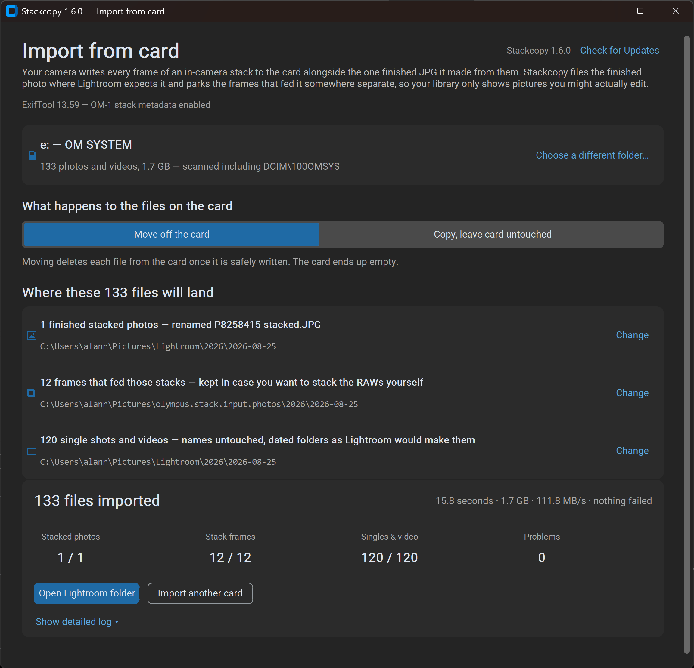

# stackcopy

Olympus / OM-System in-camera stacking produces many RAW/JPG frames per final JPG. Other importers like Lightroom don't automatically group or separate them, so imports get cluttered. This script separates originals from stacked outputs automatically, so you only need to process the photos that need your attention.

Works on Linux, macOS, WSL, and Windows. Tested on OM System OM1 & OM System OM5.

Prefer a window to the command line? There's a point-and-click [graphical interface](#graphical-interface-gui) for the import workflow.

## How it works

Stackcopy first looks for the Olympus/OM System
`StackedImage` MakerNote. A decoded `Focus-stacked (N images)` value confirms
the output and tells Stackcopy exactly how many preceding components to select.
A decoded `No` (or another non-focus mode) rules the JPEG out. When that tag is
unavailable, Stackcopy retains its conservative JPG/RAW sequence-and-timestamp
stack detection.

MakerNote reading uses ExifTool when it is available, in batches rather than one
process per JPEG. ExifTool is optional: Stackcopy still has no required runtime
dependency beyond Python's standard library. An old ExifTool that cannot decode
the camera's MakerNotes is treated as unavailable rather than a negative result.

**ExifTool 12.41 or newer** is what makes the OM System path work — see
[ExifTool](#exiftool) below for why, and what you lose without it.

A batch is never discarded wholesale. ExifTool exits nonzero when any single file
in the batch fails, so Stackcopy parses its JSON regardless of the exit status:
valid entries are used, and only the files carrying an error — or files ExifTool
never reported on — stay unknown and fall back to the heuristic. One damaged
JPEG therefore costs one file's metadata, not the whole card's. When anything
does degrade (a nonzero exit, a timeout, unparseable output), a single concise
warning names how many files fall back. The ordinary absence of `StackedImage`
on a healthy file is not degradation and is never reported.

A stack may legitimately cross from one camera folder into the next
(`100OMSYS` → `101OMSYS`), and Stackcopy supports that. But the previous folder
may only _extend_ a sequence past the boundary — it may never supply a number
that belongs inside the current folder's own range. If the numbering overlaps or
has reset, nothing is borrowed across the boundary at all. A frame reached across
a folder boundary must also carry a plausible capture time; metadata proves the
output is an N-frame stack, but it proves nothing about a file sitting in a
different folder, so an unrelated older photo that happens to occupy a missing
number is imported as an ordinary photo instead.

For `--copy`, `--rename`, and `--stackcopy`, the simple JPG-without-RAW rule is
still used.

The matching is case-insensitive, so `IMG_1234.JPG` will match with `img_1234.orf` just fine.

Supported RAW extensions: `.orf`, `.cr2`, `.nef`, `.arw`, `.dng`, `.pef`, `.rw2`, `.raf`, `.raw`, `.sr2`. Olympus/OM `.ORI` originals are preserved as a separate companion type, so an `.ORF` and `.ORI` with the same stem cannot replace one another. An `.ORI` counts as a companion original — a JPG that has one is not treated as an unpaired in-camera output — but it is not ordinary RAW backing, so it never makes a frame look like a RAW-backed focus-stack input on its own.

Supported video extensions for `--lightroomimport`: `.mov`, `.mp4`, `.m4v`, `.avi`, `.mts`, `.m2ts`, `.mpg`, `.mpeg`, `.wmv`.

## Graphical interface (GUI)

The GUI explains the complete `--lightroomimport` workflow before anything is
moved. Choose a card and it scans in the background, counts finished stack
photos, their source frames, and ordinary photos/videos, then shows the dated
folder where each group will land. If you already have a Lightroom catalog,
set the Lightroom destination to the directory where you store its images;
Stackcopy creates the same year/day hierarchy Lightroom would make. The raw
frames that fed in-camera stacks stay in a separate archive so they do not
clutter the library.



### Using it

1. **Launch it** — open the downloaded app.
2. **Choose the source card** — select the card itself or its `DCIM` folder.
   Stackcopy scans recursively and shows the media count, total size, and camera
   subfolders it found.
3. **Choose move or copy** — **Move off the card** is the default and removes
   each source only after its destination is safely written. **Copy, leave card
   untouched** maps to `--leave-on-card` and preserves everything on the card.
4. **Review where the files will land** — the three rows separate finished
   stacked photos, the frames that fed those stacks, and ordinary shots/videos.
   Click **Change** on a row to choose a different base folder. These choices
   are remembered in `gui-state.json` as before.
5. **Import or preview** — the main button includes the planned file count.
   **Preview without moving anything** runs the same plan as a dry run. The
   collapsed **Advanced** section contains Verbose log, Detect stacks, and Show
   stack debug output.
6. **Follow the import** — the running view names the phase and current file's
   role, estimates time remaining, and counts stacked photos, stack frames,
   singles/video, and problems separately. **Stop after this file** is safe:
   operations happen one file at a time and a later run picks up the rest.
   Expand **Show detailed log** only when you need the raw CLI output or want to
   copy it.
7. When it finishes, use **Open Lightroom folder** or **Import another card**.
   If a removable card is empty after a successful move, Stackcopy reminds you
   to format it in the camera before the next shoot.

Files land in exactly the same place as the `--lightroomimport` command — see
[Where files go](#where-files-go).

### Update notifications

The GUI asks GitHub once a day whether a newer Stackcopy has been released, in
the background, a couple of seconds after the window opens. If there is one, a
quiet line appears under the header — _Stackcopy 1.7.0 is available_ — with
**View update** for the release notes. **Check for Updates**, beside the version
number in the header, runs the same check on demand and always tells you the
answer, including when you are already up to date.

- **Stackcopy never downloads or installs anything.** The update dialog offers
  **Skip This Version**, **Remind Me Later**, **View Changelog**, and **Open
  Release** — that last one opens the GitHub release page in your browser, and
  the URL is verified to belong to this project before it is opened. Updating
  is still you, downloading the new app.
- **Build-only releases are ignored on purpose.** Tags like `v1.6.0-build2`
  re-cut the same application version, usually to fix something about the
  packaging rather than the program. Stackcopy treats `v1.6.0`, `v1.6.0-build1`
  and `v1.6.0-build9` as the same version 1.6.0 and stays quiet about them. If a
  change matters to you, it gets a new version number.
- **Skipping is per application version.** Skip 1.7.0 and every `1.7.0-buildN`
  stays skipped too; 1.7.1 notifies normally. **Remind Me Later** just closes
  the notice, and a later check can raise it again.
- **You can turn it off.** Set `"update_check_enabled": false` in
  `gui-state.json` (see [Using it](#using-it) for where that lives) and no
  automatic check runs. **Check for Updates** still works when you ask for it.
- The check is unauthenticated, has a short timeout, and sends nothing about
  you. If it fails — no network, GitHub unreachable — an automatic check fails
  silently and retries in about an hour rather than interrupting you.

### Easiest: download the app

Grab the prebuilt app from the [Releases page](https://github.com/AlanRockefeller/stackcopy/releases):

- **macOS** — `Stackcopy.dmg`: open it, drag **Stackcopy** to Applications, launch it.
- **Windows** — `stackcopy-windows.zip`: unzip it, then double-click `Stackcopy.exe`.
  Keep `StackcopyCLI.exe` in the same folder; the GUI uses it for imports.
  ExifTool 13.59 is bundled, so OM-1 camera stack metadata works out of the box.

macOS users who want OM-1 camera stack metadata should also run
`brew install exiftool` — see [ExifTool](#exiftool).

Detailed beginner install guides are in [build/INSTALL-macOS.md](build/INSTALL-macOS.md)
and [build/INSTALL-Windows.md](build/INSTALL-Windows.md).

> **First launch of an unsigned app:** macOS may say it's from an unidentified
> developer — right-click the app and choose **Open**, then **Open** again.
> Windows SmartScreen may warn — click **More info → Run anyway**.

## Command Line Installation

Clone the repo:

```bash
git clone https://github.com/AlanRockefeller/stackcopy.git
cd stackcopy
```

Or download just the script:

```bash
wget https://raw.githubusercontent.com/AlanRockefeller/stackcopy/main/stackcopy.py
chmod +x stackcopy.py
```

On Windows, download `stackcopy.py` and run it with `py`:

```powershell
py .\stackcopy.py --help
```

**Requirements**: Python 3.10 or newer. No extra packages needed.

### Run from source

Works anywhere Python does (Linux, macOS, Windows):

```bash
pip install -r requirements-gui.txt
python stackcopy_gui.py
```

The only extra dependency is `customtkinter`. If you get a `tkinter` import
error, install Tk for your platform (`brew install python-tk` on macOS, or your
distro's `python3-tk` package on Linux; it's already included on Windows).

### Build the app yourself

The workflow in `.github/workflows/build-gui.yml` builds both the macOS `.dmg`
and the Windows bundle automatically when you push a version tag
(`git tag v1.0.0 && git push --tags`) and attaches them to the release. To
build locally on the matching OS:

```bash
pip install -r requirements-gui.txt -r requirements-build.txt
python packaging/fetch_exiftool.py    # Windows only; bundles ExifTool 13.59
pyinstaller packaging/stackcopy_gui.spec
# -> dist/Stackcopy.app (macOS)
# -> dist/Stackcopy/Stackcopy.exe + StackcopyCLI.exe (Windows)
# -> dist/Stackcopy (Linux)
```

`fetch_exiftool.py` downloads a pinned ExifTool release, verifies its SHA-256,
and fails rather than bundling anything unexpected. It is a no-op off Windows.
Skipping it still produces a working build — the app just uses ExifTool from
`PATH` and says so.

PyInstaller can't cross-compile, so build the macOS app on a Mac and the
Windows app on Windows — or just let the workflow do both.

## The five modes

### `--copy SRC_DIR DEST_DIR`

Finds JPGs without matching RAW files and copies them to a destination folder.

```bash
./stackcopy.py --copy /photos/Lightroom/2025/2025-07-10/ /photos/stacked-images
```

### `--rename [DIR]`

Finds those JPGs and renames them in-place by adding " stacked" to the filename.

```bash
./stackcopy.py --rename /photos/Lightroom/2025/2025-07-10/
```

### `--stackcopy [DIR]`

Copies them to a "stacked" subfolder and adds " stacked" to their names.

```bash
./stackcopy.py --stackcopy /photos/Lightroom/2025/2025-07-10/
```

### `--lightroom [DIR]`

Moves the input files of a stack to a dated folder structure and renames the output file in place. Groups based on numeric sequence and timestamp window — the idea is that in-camera focus stacks are renamed and the inputs saved to a separate place, but single shots or focus bracketing aren't moved since you'll want to process those manually.

```bash
./stackcopy.py --lightroom /photos/camera-import/
```

### `--lightroomimport [DIR]`

The full workflow. Scans the source directory recursively, plans all moves first, shows a summary, then moves files oldest-first by file modification time, which normally corresponds to capture time on a camera card. Stack inputs go to a separate directory, stacked outputs and remaining files go to your Lightroom library. Videos are treated like single-shot photos and moved to the same dated Lightroom destination. It doesn't actually import to Lightroom - it just puts the photos and videos where Lightroom would have put them - except for the stack input files, which go to a different directory. You'll want them if you don't like how the in-camera stacking worked, or want to stack the raw files.

```bash
./stackcopy.py --lightroomimport /photos/camera-import/
```

Want to review the plan before it runs? Use interactive mode:

```bash
./stackcopy.py --lightroomimport /photos/camera-import/ -i
```

## Where files go

### Stack input files

When using `--lightroom` or `--lightroomimport`, stack input frames are moved to:

```
<Pictures>/olympus.stack.input.photos/YYYY/YYYY-MM-DD/
```

Override with the `STACKCOPY_STACK_INPUT_DIR` environment variable.

### Lightroom import destination

When using `--lightroomimport`, stacked outputs, single-shot/focus-bracket photos, and videos go to:

```
<Pictures>/Lightroom/YYYY/YYYY-MM-DD/
```

Override with the `STACKCOPY_LIGHTROOM_IMPORT_DIR` environment variable.

The `YYYY/YYYY-MM-DD` directories are based on each file's filesystem modification time, not EXIF `DateTimeOriginal`. On a camera card, this modification time normally corresponds to when the photograph or video was captured.

On Linux/WSL, `<Pictures>` is `~/pictures` if that directory exists, otherwise `~/Pictures`. On Windows, it's your system Pictures folder.

## Real-world examples

### Today's mushroom hunt

You went mushroom hunting and want to just copy the stacked photos you took today:

```bash
./stackcopy.py --copy /photos/mushrooms /photos/newstacks --today
```

### Complete Lightroom import from camera card

```bash
# Preview what will happen
./stackcopy.py --lightroomimport /media/camera-card/ --dry --verbose

# Run with interactive confirmation
./stackcopy.py --lightroomimport /media/camera-card/ -i --verbose

# Or just run it
./stackcopy.py --lightroomimport /media/camera-card/ --verbose
```

This will scan all files, including files in camera subfolders such as `DCIM/100OMSYS` and `DCIM/101OMSYS`, detect stacked outputs, plan all moves and show a summary, then move everything oldest-first: stack input frames to the input archive, stacked outputs (with " stacked" suffix) to your Lightroom library, and all remaining photos and videos to your Lightroom library.

A successful run ends with a summary like:

```
Done. Imported 342 files in 18.4s. Breakdown: 12 stacks (12 stacked outputs, 96 input files), 234 remaining. Data: 8.6 GB at 479.3 MB/s average. Failures: 0.
```

### Add a custom prefix

```bash
./stackcopy.py --stackcopy /photos/mushrooms --prefix "Jackson State Forest"
# Creates files like: "IMG_1234 Jackson State Forest stacked.jpg"
```

The prefix also applies to stacked outputs in `--lightroom` and
`--lightroomimport`.

### Debug stack detection

If stacks aren't being detected correctly:

```bash
./stackcopy.py --lightroom /photos/camera-import/ --debug-stacks --dry
```

This shows which files are being considered, timestamp gaps between frames, why stacks are accepted or rejected, and whether the burst safety check is triggering.

## All options

### Operation modes (pick one)

- `--copy SRC DEST` — Copy orphaned JPGs from SRC to DEST
- `--rename [DIR]` — Rename orphaned JPGs in-place (default: current directory)
- `--stackcopy [DIR]` — Copy to a "stacked" subfolder with renamed files
- `--lightroom [DIR]` — Move stack inputs to a dated folder, rename outputs in place
- `--lightroomimport [DIR]` — Full recursive import: plans all moves, then executes oldest-first

### Date filters

- `--today` — Only process files from today
- `--yesterday` — Only process files from yesterday
- `--date YYYY-MM-DD` — Only process files from a specific date

Date filters work with all modes and use filesystem modification dates. In `--lightroomimport`, a valid stack is selected by its stacked output's date; all of that stack's input frames stay with it even if an individual frame's modification time falls just across a date boundary.

### Other options

- `--prefix PREFIX` — Add custom text before " stacked" in filenames. Because the prefix becomes part of a filename, path separators, NUL and control characters, and a bare `.` or `..` are rejected with an explanation rather than silently rewritten (plus `: * ? " < > |` on Windows). Ordinary human-readable prefixes, spaces included, are unaffected.
- `--dry` / `--dry-run` — Preview what would happen without making changes
- `-v` / `--verbose` — Show detailed info about each file processed
- `-i` / `--interactive` — Ask for confirmation before moving (`--lightroomimport` only)
- `--leave-on-card` — Copy during `--lightroomimport` instead of moving, leaving source files in place
- `--plan-json` — With `--lightroomimport`, scan and emit one JSON import plan without moving or copying files
- `--force` — Overwrite existing files without asking
- `-j N` / `--jobs N` — Set the parallel worker count. `--copy` and `--stackcopy` default to one worker unless this option is supplied. During a normal run, `--lightroom` automatically chooses up to 4 workers when its effective worker count is still 1. `--lightroomimport` always forces sequential execution to preserve oldest-first order. Values above 2× the CPU count are capped.
- `--debug-stacks` / `--debugstacks` — Show detailed diagnostics for stack detection
- `--no-stack-detection` — Import Lightroom-mode files without automatic stack sorting
- `--version` — Show the installed Stackcopy version

## Stack detection in Lightroom modes

For `--copy`, `--rename`, and `--stackcopy`, the rule is simple: if a JPG has no matching RAW file, it's treated as a finished camera output.

For `--lightroom` and `--lightroomimport`, the script does more work to identify which input frames belong to each stacked output:

- Groups files by numeric sequence (e.g., `P8081885` through `P8081891`). Numeric stack detection requires at least six digits in the numeric portion of the filename.
- Confirms frames were taken within a short time window of each other (6 seconds between inputs, up to 120 seconds lag for the output)
- Accepts heuristic stacks with 3–15 input frames
- Rejects candidates when a tight burst continues before or after them, to avoid moving focus-bracketing frames even when an older photo breaks the backward scan
- Treats inputs already claimed by a later valid stack as a stack boundary, preserving rapid consecutive in-camera stacks

The 3–15 limit and RAW-backing requirement apply only to the heuristic. A
metadata-confirmed stack may contain more than 15 inputs and does not require
RAW files as proof. Sequence and timestamps are then localization and sanity
signals, not the proof of the stack. If some of the camera-reported N preceding
frames are missing, Stackcopy keeps the confirmed `stacked` output classification,
prints a warning, and sorts the available consecutive inputs; it does not
silently reclassify the output as an ordinary photo.

For the fallback heuristic, automatic stack sorting requires ordinary
RAW-backed input frames (`.ORF`, `.CR2`, `.NEF`, `.ARW`, and friends — `.ORI`
companions do not count). If a camera folder and filename-prefix group contains JPGs but no RAW
files, Stackcopy does not guess: it imports the JPGs normally and recommends
RAW+JPG. A mixed set is rejected with neutral diagnostics instead of claiming
RAW capture is disabled. The adjacent-camera-roll exception remains in place
so a stack can span folders such as `100OMSYS` and `101OMSYS`.

Use `--debug-stacks` with `--dry` to see exactly why each stack is accepted or rejected.

## ExifTool

ExifTool is **optional**. Stackcopy runs fine without it, and nothing is ever
downloaded at runtime.

| ExifTool             | What Stackcopy does                                                                                                                       |
| -------------------- | ----------------------------------------------------------------------------------------------------------------------------------------- |
| **12.41 or newer**   | Reads the OM SYSTEM `StackedImage` MakerNote — the camera's own word for "this JPG is an N-frame focus stack"                             |
| **Older than 12.41** | Runs it anyway (Olympus MakerNotes still work), but OM-1 files read as an unrecognized MakerNote block, so the fallback heuristic decides |
| **Not installed**    | Falls back to the heuristic                                                                                                               |

ExifTool 12.41 (March 2022) is the release that added `OM SYSTEM` MakerNote
support. Before it, ExifTool only knew the older `OLYMPUS` signature, so an
OM-1's MakerNote block is unrecognized and the `StackedImage` tag simply never
appears. That is a hard capability floor, not a preference. Stackcopy 1.6.0 is
tested against **ExifTool 13.59**, and newer is always fine.

### Why it matters

The fallback heuristic is conservative and works very well — but it works by
looking at a stacked JPG's **RAW source frames**. When those are not there, it
has nothing to reason about. A real in-camera focus-stacked JPG can be missed
when:

- you shoot JPEG-only,
- the `.ORF` files were already deleted or never copied,
- or a folder holds the finished stacked JPG but not its matching RAW frames.

A suitable ExifTool reads the answer out of the finished JPG itself, so it does
not need the RAW companions to prove the JPG is an in-camera stack. That is the
main reason to install a recent ExifTool.

It also brings some smaller benefits: authoritative confirmation instead of
filename-and-timestamp inference, the camera-declared frame count, better
handling of incomplete source-frame sets, recognition of stacks that fall
outside the heuristic's 3–15-frame and RAW-backing assumptions, and fewer
ambiguous burst/timing calls.

None of this means Stackcopy is broken without ExifTool. With JPG+ORF pairs
present, the heuristic is usually right.

### Checking what you have

```bash
exiftool -ver          # your ExifTool, e.g. 13.59
./stackcopy.py --version   # Stackcopy 1.6.0
```

Every Lightroom-mode run also says so itself, on stderr, before it starts
scanning:

```text
ExifTool 13.59 — OM System stack metadata enabled
```

or, if there is a problem worth fixing:

```text
ExifTool 12.40 is too old for OM System MakerNotes.
Using fallback detection; stacks without matching ORF files may be missed.
Update ExifTool (12.41 or newer, 13.59 recommended).
```

`--no-stack-detection` runs say nothing about ExifTool, because it is
irrelevant to them.

### Installing it

- **macOS**: `brew install exiftool`
- **Linux**: `apt install libimage-exiftool-perl` (or your distro's package).
  Check the version — some distributions ship a release older than 12.41.
- **Windows**: download the package from <https://exiftool.org/>, rename
  `exiftool(-k).exe` to `exiftool.exe`, keep the `exiftool_files` folder beside
  it, and put both somewhere on your `PATH`.

### Packaged GUI builds

| Build                                 | ExifTool                                                              |
| ------------------------------------- | --------------------------------------------------------------------- |
| **Windows** (`stackcopy-windows.zip`) | **Bundled** — ExifTool 13.59 ships inside the app, nothing to install |
| **macOS** (`Stackcopy.dmg`)           | **Not bundled** — install it yourself (`brew install exiftool`)       |
| Running from source (CLI or GUI)      | Uses ExifTool from your `PATH`                                        |

The Windows bundle is fetched at build time from a pinned release whose
SHA-256 is verified; a mismatch fails the build. macOS is deliberately left
out: ExifTool ships there as a `.pkg` installer or as a Perl distribution that
would depend on macOS's deprecated system Perl, and a fragile bundle is worse
than a one-line `brew install`.

Either way the GUI shows what it found in its header, and offers a link to
<https://exiftool.org/> when something is missing or too old. It never
downloads or installs anything by itself.

Set `STACKCOPY_EXIFTOOL=/path/to/exiftool` to point Stackcopy at a specific
build; a packaged app otherwise prefers the one it shipped with, and everything
else uses `PATH`.

## Safety and recovery

stackcopy is designed to be cautious:

- **Atomic file handling**: Same-filesystem moves use an atomic rename. Copies and cross-filesystem moves are written to a temporary file in the destination directory and atomically replaced, avoiding partially written destination files.
- **Durability before deletion**: A cross-filesystem move never deletes the source until the destination has been flushed to storage. The copy is written to a temporary file, `fsync`ed through a descriptor opened before the source's (often read-only) permissions are stamped onto it, atomically renamed into place, and — on platforms that support it — the destination directory entry is flushed too; only then is the source removed. If the file flush fails, the source is left untouched and the operation is reported as a failure, not a move. Windows has no directory file descriptor and NTFS journals its own metadata, so directory flushing is skipped there rather than failing the import; the same applies to exFAT cards, CIFS shares, and WSL's `/mnt/` bridge, which report a one-time note.
- **Every file lands in exactly one outcome**: The `--lightroomimport` summary keeps normal placements, recoveries, stuck sources, and failures apart — `Files safely placed: N` broken into `Imported normally`, `Recovered to fallback destination`, and `Copied successfully but source could not be removed`, with `Failures` counting only files that never reached any destination. A recovered file is never reported as a normal import, and the headline `Imported N files` counts only the files that actually left the card. `--lightroom` follows the same rule: a source it could not remove is not counted in `Moved N input files`.
- **"Copied, but the source remains"**: If the destination copy succeeds and the source deletion then fails, stackcopy does not call that a completed move. It is counted and reported separately (`Copied successfully but source could not be removed: N`, with the paths listed), the destination is not retried or recovered, and the run exits nonzero. Re-running is safe: the matching destination is recognized as identical and nothing is duplicated. Copies made because `--leave-on-card` was requested are ordinary successes.
- **Visible forced overwrites**: `--force` may replace a differing file that predates the run, but never silently. Every such destination is printed (`Overwriting differing existing file because --force:`, or `Would overwrite ...` in a dry run) with or without `--verbose`, and the summary ends with `Existing files overwritten by --force: N`. Identical destinations, 0-byte repairs, and same-run collision suffixes are not force-overwrites and are not counted.
- **Ambiguous stems are refused, not guessed**: A stem can hold only one file of each logical type. If two files map to the same type — `P8081868.ORF` and `P8081868.DNG`, or `X.JPG` and `X.JPEG`, or `X.MOV` and `X.MP4` — stackcopy names every file involved, leaves the entire stem untouched, keeps it out of stack detection, and exits nonzero. It never picks one and silently strands the other on the card. The summary counts every physical file left behind, not just the duplicated ones: a `P8081868.JPG` + `.ORF` + `.DNG` stem reports `Ambiguous stems left untouched: 1 (3 files)`.
- **Source and destination must not overlap**: `--lightroomimport` refuses to run when the source folder is, or is inside, the Lightroom import destination or the stack-input destination. Real paths are compared, so a symlink or a different spelling cannot get past it, and the check runs before anything is scanned or moved. The GUI applies the identical check before launching. (The inverse layout — a destination inside the source — still works: the recursive scan excludes its own destination trees.)
- **Case is not a loophole on Windows volumes**: Every comparison that gates a destructive step — is this source the same file as its destination, is this source inside a destination tree — folds case when the path lives where case does not distinguish files: Windows, macOS, and a Windows drive reached through WSL's `/mnt/c/...` bridge, which Python's own `normcase()` leaves untouched on Linux. `/mnt/c/Photos/P8081234.JPG` and `/mnt/c/photos/p8081234.jpg` are recognized as one photo even on a mount that reports no usable inode numbers, so a "move" can never delete the only copy. Ordinary Linux paths stay case-sensitive.
- **Self-healing**: Automatically detects and replaces 0-byte placeholder files left behind by interrupted previous runs.
- **Identical-file detection**: If the destination already has the same content, the operation proceeds safely even with `--force` (deleting only the redundant source for moves, skipping the destination write for copies).
- **Collision-safe renaming**: When a destination file already exists with different content, stackcopy adds a suffix (e.g., `IMG_1234__2.JPG`) to avoid overwriting. This keeps paired files (JPG + RAW + ORI) together under the same suffix. `--force` may replace a file that predates the run, but it never lets one source in the current run overwrite another. If every candidate suffix is taken, Stackcopy refuses to guess: it reports the stem, leaves those files on the source, and exits nonzero rather than reusing a rejected name.
- **Disk space preflight**: The import plan is shown before any low-space confirmation. Dry runs report low space but never prompt or mutate files.
- **Safe to re-run**: Stackcopy avoids adding "stacked" a second time, detects identical destination files, and is designed so interrupted imports can be run again safely.
- **Visible leftovers**: Unrecognized extensions are left on the source and summarized by extension rather than silently ignored.
- **Clean interruption and recovery**: In both `--lightroom` and `--lightroomimport`, a destination-directory error is reported with its destination and affected files, counted as a failure, and the summary is still printed. Ctrl-C stops new operations, leaves completed work in place and unstarted files untouched, prints a partial summary, and exits with status 130. Recovery puts otherwise stranded files into the normal dated Lightroom hierarchy, reports them separately from successful primary placements, and counts only genuinely unrecovered failures as failures.
- **Recovery is a degraded outcome, not a plain success**: Recovered files are safe, but they are not where the plan said they would go. When anything is recovered, stackcopy prints `Import completed with recovery.` with the fallback destinations and a recommendation to review, and exits nonzero. The GUI shows "Import finished, but not as planned" instead of a normal completion. A fully successful import still exits 0.
- **Companion files stay in one date folder**: A frame's JPG, RAW, and `.ORI` derive their destination date from a single canonical timestamp (RAW first, then `.ORI`, then JPG), so mtimes that straddle midnight cannot split one frame across two date directories. Videos are independent recordings and keep their own date.

### After an interrupted import

Re-running is always safe. For the best result on OM/Olympus focus stacks, re-run with a current ExifTool installed. An interrupted import may already have moved some components of a stack out of the source folder, and the JPG/RAW sequence heuristic can then classify the remainder differently on the second pass. The `StackedImage` MakerNote does not depend on which siblings are still present, so with ExifTool available the confirmed outputs and their frame counts are recognized exactly as they were the first time.

### Olympus / OM System file numbering

Olympus / OM System cameras may use filenames with a date-derived prefix followed by a four-digit sequence number. For example, in `P8081868.ORF`, `P808` represents the date portion and `1868` is the sequence number.

On the OM-1, **Menu → Card/Folder/File → File Name** can be set to **Reset** or **Auto**. With **Reset**, swapping or removing cards can cause the camera to reuse sequence numbers based on the numbering on the currently inserted card. A common multiple-card scenario is:

- Cards A and B have both been used, and card B contains the later sequence numbers.
- Card B is removed or loaned to someone.
- Shooting continues on card A while **File Name = Reset**.
- The camera can reuse numbers that were already used on card B.
- If the photos were taken on the same date, their complete filenames can be identical even though they are different photographs.

For OM-1 users running Stackcopy, **File Name = Auto** is preferable, especially when rotating multiple SD cards, because it is designed to continue file numbering across card changes.

Stackcopy's collision-safe renaming makes camera-side filename reuse safe. If the destination copy is byte-for-byte identical, Stackcopy treats it as the same file and does not needlessly add `__2`. If the content differs, Stackcopy preserves both photographs and applies the same suffix to the new JPG/RAW pair:

```text
Existing:
P8081868.JPG
P8081868.ORF

Different photos arrive from the card with those same names:
P8081868__2.JPG
P8081868__2.ORF
```

The `__2` suffix is intentional data-loss protection. It does not mean Stackcopy misidentified or duplicated the photograph; the camera reused the filename, and Stackcopy kept the existing photo instead of overwriting it.

## WSL note

If you run stackcopy inside WSL against files under `/mnt/c/`, `/mnt/d/`, etc., it will be significantly slower than native Linux paths due to the 9P filesystem bridge. The script will warn you about this. To get better performance, either copy files to a native Linux path first, or run stackcopy directly on Windows. On my system, running the same command in Windows vs. WSL is 5 times faster.

## Tips

- Always run with `--dry` first to see what will happen
- Use `--verbose` when you want to understand exactly what happened
- Use `--debug-stacks` only when Lightroom-mode detection needs troubleshooting
- `--copy` and `--stackcopy` use one worker by default; use `--jobs N` when parallel copies help. `--lightroom` chooses up to 4 workers automatically, while `--lightroomimport` stays sequential to preserve file order.
- If operations are interrupted, just re-run — self-healing will fix any incomplete files
- Quote paths with spaces, especially on Windows

## Version

- **Version**: 1.6.0
- **Date**: August 24, 2026
- **Author**: Alan Rockefeller
- **Repository**: https://github.com/AlanRockefeller/stackcopy
- **License**: MIT

## License

MIT License — do whatever you want with it. See the LICENSE file for details.
